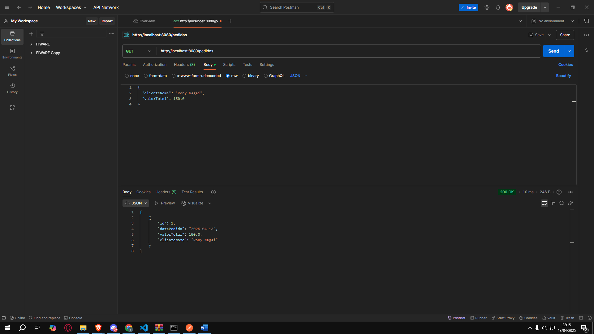
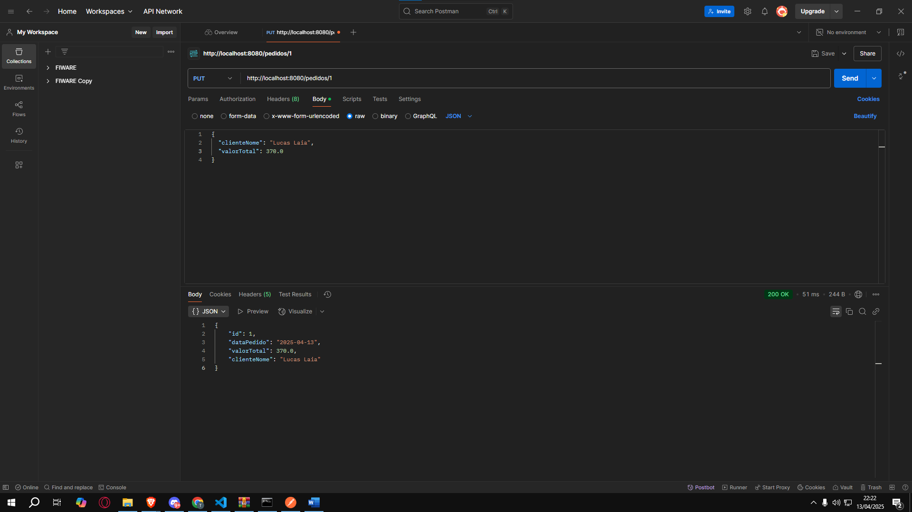
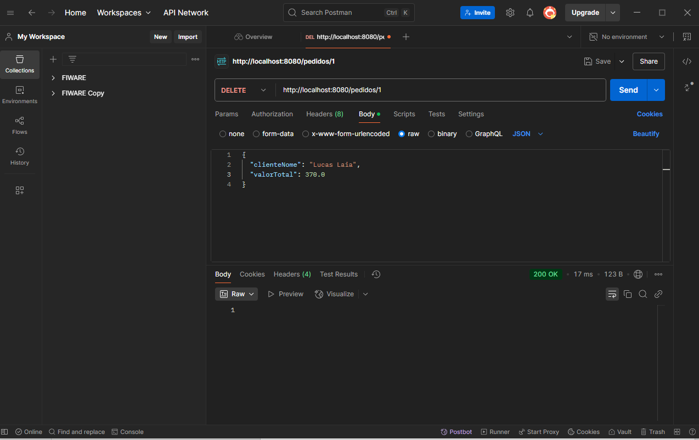

# fiap-checkpoint1 - API de Pedidos

Este projeto é uma API REST desenvolvida com Spring Boot para gerenciar pedidos de clientes, como parte do Checkpoint da disciplina de Arquitetura SOA e Web Services da FIAP.

## 👨‍💻 Integrantes do Grupo

- **Lucas Laia Manentti** – RM: 97709  
- **Rony Ken Nagai** – RM: 551549  
- **Tomáz Versolato Carballo** – RM: 551417

---

## 🚀 Tecnologias Utilizadas

- Java 17  
- Spring Boot 3.1.x  
- Spring Web  
- Spring Data JPA  
- H2 Database (em memória)  
- Maven  
- Lombok  

---

## 📁 Estrutura do Projeto

```
src/main/java/br/com/fiap/checkpoint1
├── controller        # Endpoints REST
├── model             # Entidade Pedido
├── repository        # Interface JPA
└── service           # Regras de negócio
```

---

## ⚙️ Como Executar o Projeto

1. Clone o repositório:
   ```bash
   git clone https://github.com/seu-usuario/fiap-checkpoint1.git
   ```

2. Acesse o diretório do projeto:
   ```bash
   cd fiap-checkpoint1
   ```

3. Execute o projeto com Maven:
   ```bash
   mvn spring-boot:run
   ```

4. A aplicação estará disponível em:  
   `http://localhost:8080`

---

## 🧪 Testes dos Endpoints (via Postman )

### 1. Criar um novo pedido
- **Método:** `POST`  
- **URL:** `http://localhost:8080/pedidos`  
  

### 2. Buscar todos os pedidos
- **Método:** `GET`  
- **URL:** `http://localhost:8080/pedidos`


### 3. Buscar um pedido por ID
- **Método:** `GET`  
- **URL:** `http://localhost:8080/pedidos/1`


### 4. Atualizar um pedido existente
- **Método:** `PUT`  
- **URL:** `http://localhost:8080/pedidos/1`  


### 5. Deletar um pedido
- **Método:** `DELETE`  
- **URL:** `http://localhost:8080/pedidos/1`

---

## 💾 Acesso ao Console H2

- URL: `http://localhost:8080/h2-console`  
- **JDBC URL:** `jdbc:h2:mem:pedidosdb`  
- **User:** `sa`  
- **Password:** *(em branco)*

---


## 📌 Observações

- A data do pedido (`dataPedido`) é preenchida automaticamente no momento da criação.
- Durante a atualização, esse campo é preservado e não é alterado.
- A validação impede nomes em branco e valores negativos.

---